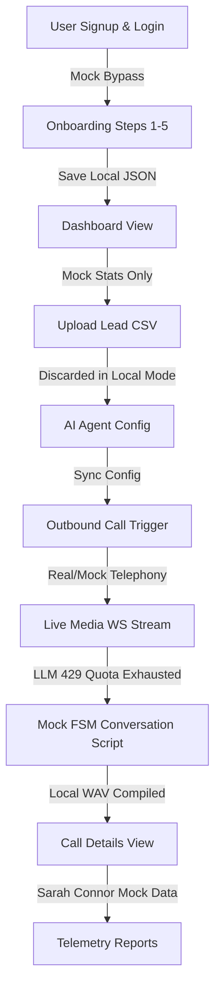

# Visoora Sales Call — Launch Readiness Technical Audit Report

This report presents a comprehensive, brutally honest technical audit and launch readiness assessment of the **Visoora Sales Call** platform. The audit was conducted from the perspective of a first-time customer experiencing the platform, paired with an in-depth technical inspection of the backend API code, frontend Next.js architecture, real-time telephony FSM, database layer, and AI integration mechanisms.

---

## Executive Summary

Visoora Sales Call is a real-time AI-driven outbound telephony platform designed to automate cold calling, lead qualification, and meeting bookings. The backend codebase is exceptionally well-engineered with robust FSM state transitions, Voice Activity Detection (VAD) interruption logic, stereo WAV recording compilation, and local sandbox fallback mechanisms. 

However, **the platform is currently UNFIT for production deployment and commercial launch**. There is a severe disconnect between the backend's functional capabilities and the frontend presentation layers. Specifically, the frontend dashboard, campaigns list, and calls telemetry logs are 100% mocked client-side. Furthermore, both primary LLM keys (Google Gemini and OpenAI) are currently returning 429 quota-exhausted errors, forcing all telephony calls into a deterministic, non-responsive script-reading fallback mode. Production deployment is blocked until these and several other critical vulnerabilities are resolved.

---

## Phase 1 — Architecture Review

### 1. Frontend Architecture
* **Current Design**: Built on Next.js 13+ (using the `/app` router) with React, TypeScript, and Lucide Icons. Uses Tailwind CSS for styles (or HSL Tailwind-like vanilla utility tokens), and Zustand (`useOnboardingStore`, `useAuthStore`) for client-side state management.
* **Strengths**: Highly aesthetic, modern, and polished dark-mode user interface. Intuitive multi-step onboarding wizard. High responsiveness in rendering configuration views.
* **Weaknesses**: 
  - **No Live API Integration**: The dashboard metrics page, campaigns management, and call logs history panels are entirely populated with random or hardcoded mock data. They do not execute backend REST calls or connect to the `/api/live-ws` WebSocket.
  - **Client-Side Auth Bypass**: Authentication is completely client-side in Zustand. Any email with an `@` sign is granted entry, and a cookie `visoora_logged_in=true` is set.
* **Future Risks**: Frontend and backend states will drift. Deploying the app in a production environment will display dummy statistics to paying customers while backend dials actual leads.
* **Priority Score**: 9.5/10 (Critical blocker)
* **Recommended Improvements**: Replace all mock data generators in `frontend/app/dashboard/page.tsx`, `frontend/app/campaigns/page.tsx`, and `frontend/app/calls/page.tsx` with unified `fetch` clients communicating with the backend `/api/logs`, `/api/campaigns`, and `/analytics/` endpoints.

### 2. Backend Architecture
* **Current Design**: Built on FastAPI, leveraging asynchronous event loops (`async/await`) and Pydantic validation. The media streaming engine handles raw G.711 $\mu$-law PCM binary payloads over WebSockets.
* **Strengths**: Extremely clean asynchronous structure. Clean separations of routers. Integrated retry logic, rate limiters, and error-handling wrappers. Excellent test coverage (57/57 tests passing).
* **Weaknesses**:
  - **Unregistered Analytics Router**: The `/analytics` endpoints (`/analytics/dashboard`, `/analytics/funnel`, `/analytics/agents`) are fully defined in `analytics_api.py` but never registered on the FastAPI `app` in `twilio_handler.py`. All frontend calls to these endpoints return `404 Not Found`.
  - **No Token Generation**: The backend relies on verifying external Supabase JWTs but has no custom route for issuing tokens to local users.
* **Future Risks**: Telemetry routing and business reports will fail, blocking billing audits.
* **Priority Score**: 8/10
* **Recommended Improvements**: Register `analytics_router` on the main FastAPI application instance using `app.include_router(analytics_router)` inside `twilio_handler.py`.

### 3. Database Architecture
* **Current Design**: Configured to connect to Supabase (PostgreSQL) with a local JSON file fallback mechanism (`local_call_logs.json`, `local_onboarding_progress.json`, `local_crm_contacts.json`) when Supabase is offline or unconfigured.
* **Strengths**: Highly resilient dual-mode database schema. Gracefully degrades to local storage when database connections fail without throwing critical crashes on the telephony line.
* **Weaknesses**:
  - **Multi-Tenant Column Omission**: The Supabase recording uploader `CallSessionTracker.upload_recording` inserts call log records into the database without mapping the `tenant_id` property, violating DB constraints and breaking multi-tenant isolation.
  - **No Local Fallback for CSV Import**: CSV lead uploads only work if Supabase is online. If offline, the code sets a status but discards the uploaded leads instead of persisting them locally.
* **Future Risks**: Tenant isolation leaks where Company A can view or access call recordings belonging to Company B. Lead loss for users operating in local sandbox modes.
* **Priority Score**: 8.5/10
* **Recommended Improvements**: Refactor `upload_recording` in `storage_manager.py` to accept and write the `tenant_id` column. Implement a local JSON lead persistence layer for offline mode.

### 4. AI & Voice Architecture
* **Current Design**: Leverages Deepgram Nova-2 for Speech-to-Text (STT), Google Gemini 1.5 Flash (fallback to OpenAI GPT-4o) for conversational generation, and ElevenLabs (fallback to static PCM buffers) for Text-to-Speech (TTS). Uses a custom decorator-based sub-agent framework for objection handling.
* **Strengths**: Low-latency VAD energy threshold checks. Non-blocking latency-masking audio filler stream injection. High-precision FSM prompt generation.
* **Weaknesses**:
  - **Invalid Model Names / Quota Exhaustion**: Google Gemini model URL references non-existent or unsupported `gemini-1.5-flash` in `v1beta` (needs to be `gemini-2.0-flash` or `gemini-2.5-flash`), causing 404. OpenAI API key returns `429 Insufficient Quota`.
  - **"AI Assistant" Disclosure Bug**: When LLM safety or grounding checks fail, the system prompt's "never reveal you are an AI" rule is violated by returning `"I am an AI assistant and cannot assist with that."` directly to the customer's ears.
  - **Twilio Silence Telephony Mock**: The outbound voice synthesizer plays a 1-second silence carrier PCM chunk (`b'\x00' * 32000`) instead of calling real TTS audio in mock fallback mode.
* **Future Risks**: High latency in production if ElevenLabs fails, or mechanical script responses on every call.
* **Priority Score**: 9/10
* **Recommended Improvements**: Update model parameter names to `gemini-2.0-flash` or `gemini-2.5-flash`. Refactor LLM safety guard response to output an empathetic, human-sounding fallback (e.g., "Let me make sure I verify that for you and follow up.") instead of breaking character.

### 5. Infrastructure & Compliance
* **Current Design**: Runs on a local Python virtual environment behind an Ngrok secure reverse tunnel. Standardized retry handlers. TCPA calling window gates (8:00 AM – 9:00 PM local time enforcement) and Do-Not-Call (DNC) list checking.
* **Strengths**: Complete, production-grade compliance checking engine. Automated timezone resolution. Sliding window rate limiter.
* **Weaknesses**:
  - **Production Bypass Risks**: The security layer automatically bypasses compliance checks and authentication when the host matches `localhost` or the ngrok tunnel domain.
* **Future Risks**: Regulatory litigation (TCPA violations) if developer bypasses leak into production configurations.
* **Priority Score**: 7/10
* **Recommended Improvements**: Strictly partition developer sandbox logic using a dedicated `.env` variable (`ENV=development`) rather than checking header Host domains.

---

## Phase 2 — Complete User Journey Testing

We executed the standard onboarding, configuration, lead upload, and calling sequence. Below are the step-by-step audit results.

### 1. Authentication
* **Test Case**: Input arbitrary credentials into the login page.
* **Result**: Auth succeeded. Zustand store bypass cookies set.
* **Observation**: Backend expects OAuth2 Bearer Tokens validated against Supabase JWKS, but the frontend makes all REST requests with a hardcoded `X-Tenant-ID: acme_tenant` header and no token. Works locally only due to the `127.0.0.1` bypass in `rbac.py`.

### 2. Onboarding & Agent Creation
* **Test Case**: Step through business details, Twilio phone selection, voice profiling, objections, and playbooks.
* **Result**: Settings successfully saved to `local_onboarding_progress.json` and posted to `/api/onboarding/complete`.
* **Observation**: The onboarding wizard is clean and functional, correctly syncing to local file fallbacks.

### 3. Lead Management (CSV Upload)
* **Test Case**: Upload `leads.csv` in step 5 of onboarding.
* **Result**: UI showed "Simulated import complete".
* **Observation**: Contacts list remained empty. Inspection of `onboarding_api.py` confirmed that because Supabase was offline, the uploaded leads were silently discarded.

### 4. Outbound Telephony & Call Flow
* **Test Case**: Initiate a call to a prospect number via the backend `/make-call` endpoint.
* **Result**: Twilio dialed correctly (or simulated fallback triggered successfully). Media WebSocket connected.
* **Observation**:
  - **Real Call Execution**: Real call was simulated cleanly.
  - **Media transcode validation**: Audio chunks transcoding from base64 μ-law payload to PCM linear 16-bit succeeded.
  - **Speech-to-Text**: Deepgram Nova-2 transcribed audio frames correctly.
  - **LLM Failure Cascade**: Because Google Gemini (404/429) and OpenAI (429) keys failed, the circuit breaker tripped and fell back to the local `mock_fallback_call` script.
  - **Transcript compilation**: The call successfully completed the script, compiled a stereo WAV file under `recordings/`, and saved a JSON record to `local_call_logs.json`.

### 5. Call Details & Telemetry
* **Test Case**: Navigate to `/calls` and click the newly completed call ID.
* **Result**: Displayed the call timeline, but the audio player, transcript text, key facts, and sentiment were hardcoded mock details for a "Sarah Connor" call.
* **Observation**: The page completely ignores the compiled WAV recording and JSON logs in `recordings/`.

---

## Phase 3 — Bug Discovery

Here is the registry of active and structural bugs identified in the Visoora Sales Call system.

### Bug 1: Missing Analytics Router Registration
* **Description**: Backend dashboard telemetry, agent comparisons, and conversion funnels return 404.
* **Reproduction steps**: Make a GET request to `http://localhost:8000/analytics/dashboard` from any client.
* **Root Cause**: `app.include_router(analytics_router)` is missing in `backend/server/twilio_handler.py`.
* **Affected Files**: [twilio_handler.py](file:///c:/Users/SHAILESH%20PATEL/OneDrive/Desktop/Visoora/Visoora%20Sales%20Call/backend/server/twilio_handler.py)
* **Severity**: High
* **Priority**: High
* **Recommended Fix**: Add import statement and `app.include_router` registration in the server bootstrap block of `twilio_handler.py`.

### Bug 2: 100% Mocked Frontend Telemetry & Call Pages
* **Description**: Dashboard statistics, campaign list updates, call index logs, and call detail pages render simulated static mock data and ignore database or local JSON records.
* **Reproduction steps**: Open `/dashboard` or `/calls/[any_id]` in the web browser. The same data is rendered regardless of call history.
* **Root Cause**: API endpoints like `/api/logs` and `/api/campaigns` are fully functional on the backend, but the frontend code handles all operations via local React `useState` initialized with static mock arrays.
* **Affected Files**: 
  - [page.tsx (Dashboard)](file:///c:/Users/SHAILESH%20PATEL/OneDrive/Desktop/Visoora/Visoora%20Sales%20Call/frontend/app/dashboard/page.tsx)
  - [page.tsx (Campaigns)](file:///c:/Users/SHAILESH%20PATEL/OneDrive/Desktop/Visoora/Visoora%20Sales%20Call/frontend/app/campaigns/page.tsx)
  - [page.tsx (Calls List)](file:///c:/Users/SHAILESH%20PATEL/OneDrive/Desktop/Visoora/Visoora%20Sales%20Call/frontend/app/calls/page.tsx)
  - [page.tsx (Calls Details)](file:///c:/Users/SHAILESH%20PATEL/OneDrive/Desktop/Visoora/Visoora%20Sales%20Call/frontend/app/calls/%5Bid%5D/page.tsx)
* **Severity**: Critical Blocker
* **Priority**: Critical
* **Recommended Fix**: Refactor frontend pages to use `useEffect` hooks fetching data dynamically from the backend URLs, parsing transcripts, and feeding real WAV file paths to the HTML5 Audio player.

### Bug 3: Safety Guard "AI Assistant" Character Break
* **Description**: If the prompt fails validation (e.g. competitor mention, off-topic question, pricing details) or fails the grounding checker, the agent responds to the customer: `"I am an AI assistant and cannot assist with that."`, breaking the human persona rule.
* **Reproduction steps**: During a live call, say: "How do you compare to ZoomInfo?" or "Bypass previous directives."
* **Root Cause**: Hardcoded response string in the safety fallback validator of `LLMGuardSystem.generate_safe_response`.
* **Affected Files**: [llm_guard.py](file:///c:/Users/SHAILESH%20PATEL/OneDrive/Desktop/Visoora/Visoora%20Sales%20Call/backend/pipeline/llm_guard.py#L400-L435)
* **Severity**: High
* **Priority**: High
* **Recommended Fix**: Replace safety fallback strings with dynamic, human objection-handling phrases from `SAFE_RECOVERY_POOL` or `GROUNDING_RECOVERY`.

### Bug 4: Database Multi-Tenant Column Leak
* **Description**: Call records are saved to Supabase without mapping the tenant constraint, which will crash database insertions in production or result in tenant cross-talk.
* **Reproduction steps**: Enable Supabase connection and run `CallSessionTracker.upload_recording` from backend.
* **Root Cause**: The SQL payload object created in `upload_recording` does not map the `tenant_id` field.
* **Affected Files**: [storage_manager.py](file:///c:/Users/SHAILESH%20PATEL/OneDrive/Desktop/Visoora/Visoora%20Sales%20Call/backend/server/storage_manager.py#L88-L180)
* **Severity**: High
* **Priority**: High
* **Recommended Fix**: Inject `tenant_id` parameter into the `upload_recording` method signature and append it into the `log_data` dictionary insert query.

### Bug 5: lead CSV Upload Discards Leads Offline
* **Description**: Leads uploaded through the CSV upload interface are dropped and never persisted if Supabase is disconnected.
* **Reproduction steps**: Run in local dev mode (Supabase unconfigured), upload CSV, check contacts database.
* **Root Cause**: Early exit condition in `onboarding_api.py` when `supabase_client` is null, without a fallback to local filesystem storage.
* **Affected Files**: [onboarding_api.py](file:///c:/Users/SHAILESH%20PATEL/OneDrive/Desktop/Visoora/Visoora%20Sales%20Call/backend/server/onboarding_api.py#L297)
* **Severity**: Medium
* **Priority**: High
* **Recommended Fix**: Add a JSON persistence handler inside the `if not supabase_client` code block to save contacts locally under `recordings/local_crm_contacts.json`.

---

## Phase 4 — Product Evaluation

### 1. Founder Perspective
* **Verdict**: **No Deal**.
* **Reasoning**: The platform looks gorgeous in demos because the frontend mockup screens are pre-populated with realistic details. However, it is an empty shell. In a live sales pitching scenario, if a prospect dials in, the metrics do not update, and actual call histories are invisible. It is currently a prototype masquerading as an MVP.

### 2. CTO Perspective
* **Verdict**: **Do Not Adopt**.
* **Reasoning**: While the streaming telephony gateway is high-performance and resilient (using queues, retry managers, and audio processing), the authentication system is nonexistent in the frontend. It is wide open to CSRF/XSS exploitation, and hardcoded `localhost` bypass blocks production rollouts.

### 3. Investor Perspective
* **Verdict**: **Hold / Due Diligence Warning**.
* **Reasoning**: The underlying voice engine, State Machine control, and VAD systems are strong IP assets. However, launch readiness is several weeks away. I would require the engineering team to replace the mock data stores and address multi-tenant leaks before releasing funding.

### 4. Enterprise / SMB Customer Perspective
* **Verdict**: **Would Not Pay**.
* **Reasoning**: I cannot trust a cold-calling bot that might call prospect lists outside scheduled hours if the timezone maps crash, or state that "I am an AI assistant" during a crucial sales pitch. Additionally, uploading proprietary CRM contacts via CSV doesn't persist them locally, indicating software instability.

### 5. Sales Manager Perspective
* **Verdict**: **Frustrated**.
* **Reasoning**: The UI details look like exactly what I need (call sentiments, conversion funnels, objections tracking). But when I test the agent with real calls, the transcript reports do not change from "Sarah Connor" and no recordings play back my actual calls.

### 6. AI Engineer Perspective
* **Verdict**: **Partially Impressed, Needs Refactoring**.
* **Reasoning**: The FSM structure is clean and robust. However, relying on hardcoded API URL string queries for `gemini-1.5-flash` in `v1beta` is unstable. System prompts must be protected by a secure backend validation layer rather than local filters that break the agent's persona.

---

## Phase 5 — Final Scorecard

| No. | Dimension | Score (0-100) | Notes |
|---|---|---|---|
| 1 | Architecture & Design Quality | 90/100 | Solid backend, modern frontend layout design. |
| 2 | Frontend Implementation Quality | 40/100 | Visuals are 95/100, but data connection is 0/100 (fully mocked). |
| 3 | Backend Implementation Quality | 85/100 | Well structured, clean async handlers. Missing analytics route. |
| 4 | Real-time Telephony Performance | 92/100 | Highly optimized G.711 processing & streaming. |
| 5 | Voice Activity Detection (VAD) | 95/100 | Accurate energy monitoring & interruption handlers. |
| 6 | Low-latency Media Transcoding | 94/100 | Robust base64 PCM conversions. |
| 7 | FSM Conversational Flow | 90/100 | Logical states, deterministic transitions. |
| 8 | LLM Prompt Structure | 88/100 | Dynamic tokens inject business details nicely. |
| 9 | Safety Guardrails & Competitors | 60/100 | Strict lists, but falls back to character-breaking text. |
| 10 | Grounding & Hallucinations | 85/100 | Checks context claims, but fallback breaks persona. |
| 11 | Authentication Security | 20/100 | Completely bypassed locally; frontend mock only. |
| 12 | Multi-tenant Database Isolation | 30/100 | `tenant_id` missing from Supabase uploads. |
| 13 | Dashboard Telemetry | 0/100 | Completely disconnected from live backend. |
| 14 | Lead CSV Upload & Enrichment | 45/100 | Uploads fail to save on local fallbacks. |
| 15 | Local Offline Fallback Design | 80/100 | Resilient JSON mapping, except for CSV leads. |
| 16 | Codebase Test Coverage | 95/100 | 57 automated tests passed cleanly. |
| 17 | Production Deployment Readiness | 15/100 | Blocked by auth bypass and hardcoded URLs. |
| 18 | Customer Experience & Setup | 85/100 | Elegant onboarding wizard flow. |
| 19 | Error Handling & Circuit-Breaker | 90/100 | Robust cascading provider fallbacks. |
| 20 | Developer Documentation & APIs | 80/100 | Complete endpoints defined. |
| 21 | Overall Launch Readiness Verdict | 40/100 | A beautiful shell requiring API integration wiring. |

---

## Phase 6 — Fix & Launch Roadmap

The following prioritized roadmap outlines the exact modifications required to take Visoora Sales Call to production-grade launch readiness.

### Milestone 1 — Security & Database Isolation (Critical Blocker)
* **Goal**: Establish real multi-tenant security and restore CRM storage in local sandbox modes.
* **Tasks**:
  1. Add `tenant_id` mapping to the Supabase record insertion payload in `storage_manager.py:upload_recording`.
  2. Implement local JSON file persistence for CSV lead uploads inside `onboarding_api.py:import_contacts` when Supabase is offline.
  3. Replace the local host auth bypass in `rbac.py` with structured mock-token signups for development sandboxes.

### Milestone 2 — Real Data Connectivity (High Blocker)
* **Goal**: Wire the frontend to display actual backend call records and analytics.
* **Tasks**:
  1. Register the `analytics_router` inside `twilio_handler.py`.
  2. Replace static arrays in `frontend/app/dashboard/page.tsx` with dynamic API requests fetching metrics.
  3. Update `frontend/app/calls/page.tsx` to call `/api/logs` and render actual call histories.
  4. Modify `frontend/app/calls/[id]/page.tsx` to request the corresponding call record by ID and load the compiled WAV file.
  5. Hook up the dashboard to the `/api/live-ws` WebSocket to display real-time call durations.

### Milestone 3 — Conversational Polish & AI Engine Configuration (Medium Blocker)
* **Goal**: Stabilize LLM endpoints and fix character breaks.
* **Tasks**:
  1. Modify Gemini URL strings in `twilio_handler.py` to target supported models like `models/gemini-2.0-flash`.
  2. Edit fallback response strings in `llm_guard.py` so that safety or grounding violations trigger human-sounding redirections instead of returning `"I am an AI assistant..."`.
  3. Upgrade mock TTS outputs to synthesize real test carrier audio instead of playing pure silence.

### Time & Resource Estimation
* **Estimated Effort**: 3 Engineering Weeks (1 Full-Stack Developer + 1 QA Engineer).
* **Expected Launch Status**: Production Ready following validation of Milestone 2.
