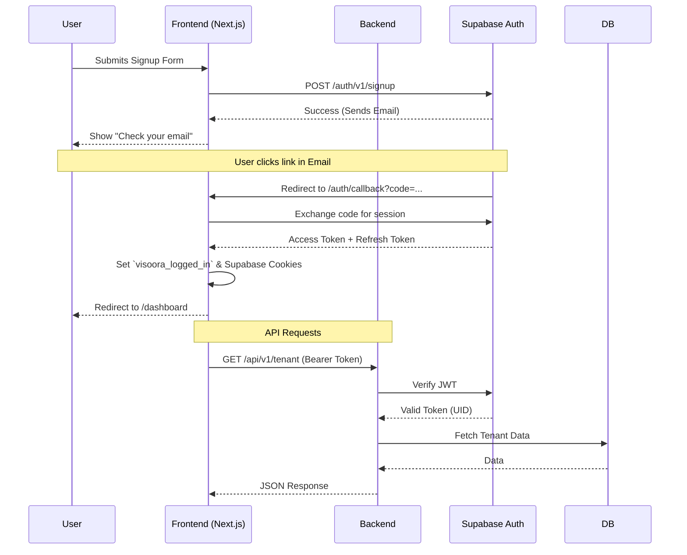

# Visoora System Architecture

This document outlines the high-level architecture of the Visoora AI Revenue Operating System.

## System Flow

```mermaid
flowchart TD
    Client[Web Browser / Next.js] --> |REST / JWT| APIGateway(FastAPI Backend)
    
    subgraph Auth Layer
        APIGateway --> SupabaseAuth[Supabase Auth]
    end

    subgraph Data Layer
        APIGateway --> DB[(PostgreSQL / Supabase)]
        APIGateway --> Cache[(Redis)]
    end

    subgraph Mission Engine (Async Workers)
        Cache --> |Task Queue| CeleryWorker[Python Async Workers]
        CeleryWorker --> DB
        CeleryWorker --> AI[AI Providers: OpenAI/Anthropic/Google]
        CeleryWorker --> EmailAPI[Resend / Email API]
    end

    Client --> |Real-time Updates| Websocket(FastAPI WebSockets)
    CeleryWorker --> |Publish Events| Cache
    Cache --> |Subscribe| Websocket
```

## Authentication Flow



## Mission & AI Pipeline Flow

```mermaid
flowchart LR
    A[User Configure Mission] --> B[Save to DB]
    B --> C[Push to Redis Queue]
    C --> D(Celery Worker: Planning)
    D --> E(Celery Worker: Research)
    E --> F[AI API (OpenAI)]
    F --> E
    E --> G(Celery Worker: Copywriting)
    G --> H[Drafts saved to DB]
    H --> I[Notify User via Email/App]
    I --> J{User Approval}
    J -->|Approved| K[Send Email via Resend]
    J -->|Rejected| L[Update AI Context & Retry]
```

## Deployment Architecture


