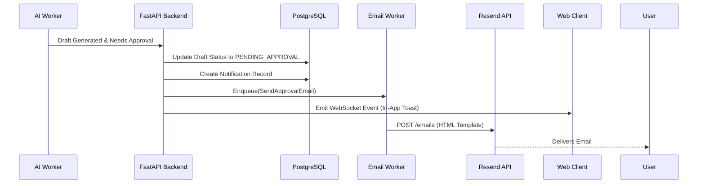

# Notification & Email Architecture

This document defines the strategy and architecture for alerting users about system events, AI actions, and required approvals.

## Architecture Overview

Notifications are critical in an asynchronous AI platform to keep the human in the loop. 

### Systems Involved
- **Backend (FastAPI):** Triggers events based on database state changes.
- **Message Broker (Redis/Celery):** Handles asynchronous delivery of emails.
- **Delivery Provider (Resend):** Delivers transactional HTML emails.
- **Frontend (Next.js):** Displays real-time toast notifications and an in-app notification center via WebSockets or polling.

## Notification Flow

## Email Templates Inventory

All templates must use a consistent, premium design system (Visoora brand colors, clean typography, clear CTAs).

| Template Name | Trigger Event | Primary CTA |
| :--- | :--- | :--- |
| `welcome.html` | Successful Signup | "Complete Business Brain" |
| `verify_email.html` | Signup / Email Change | "Verify Email Address" |
| `password_reset.html` | Forgot Password Request | "Reset Password" |
| `mission_ready.html` | Mission finished planning | "Review & Launch" |
| `approval_required.html` | AI drafted emails | "Review Drafts" |
| `meeting_booked.html` | Positive reply / Calendar sync | "View Pipeline" |
| `mission_completed.html` | Mission reaches target limits | "View ROI Report" |

## Best Practices & Rules
1. **Batching:** If a mission generates 50 drafts, do NOT send 50 emails. Batch them into a single "50 drafts require your approval" email, sent every 30 minutes or when the batch finishes.
2. **Deep Linking:** Every CTA must deep-link directly to the specific resource (e.g., `/inbox?mission_id=123`).
3. **Observability:** Track email open rates and click-through rates. Log all Resend delivery failures to Sentry.
