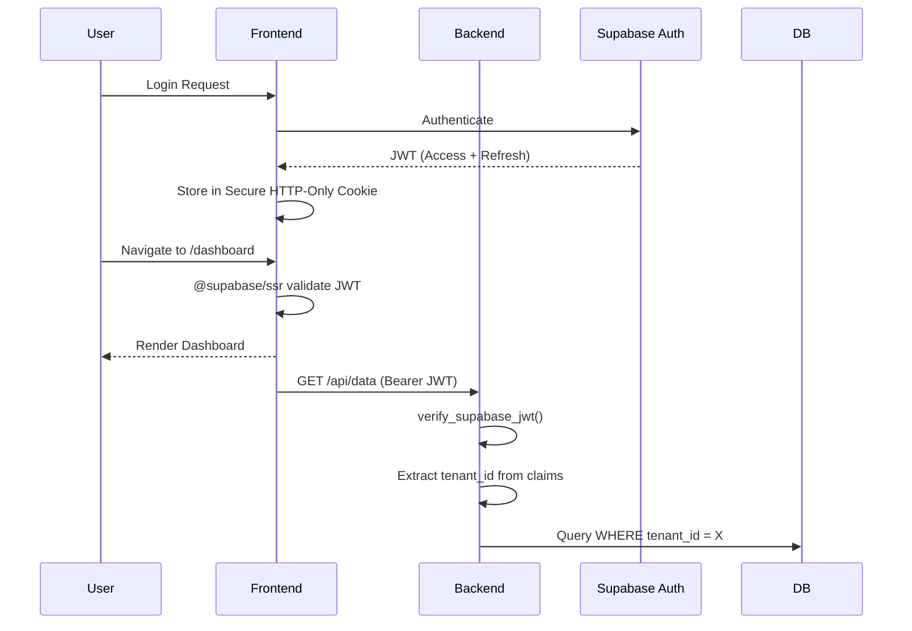
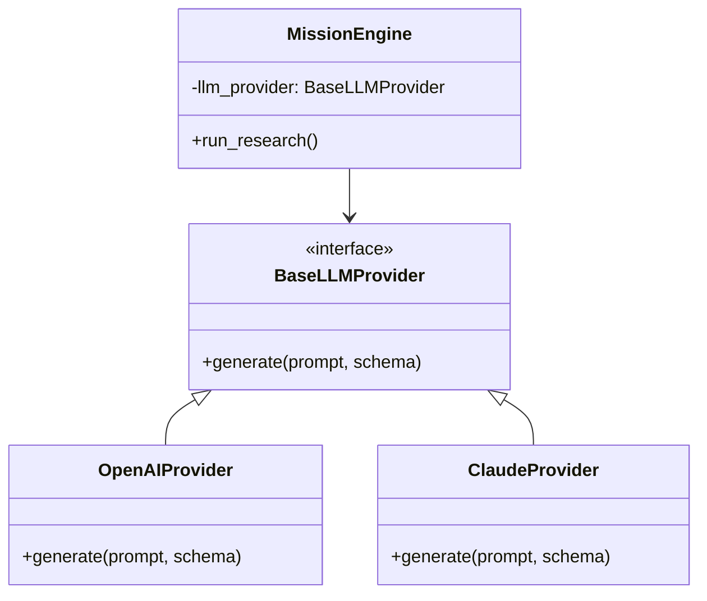

# Recommended Architecture Diagrams

## 1. System Architecture

```mermaid
flowchart TD
    Client[Next.js Client] --> API(FastAPI Gateway)
    
    API --> Supabase[(Supabase DB & Auth)]
    API --> Redis[(Redis)]
    
    Redis --> |Queue| CeleryWorker[Celery Mission Workers]
    
    CeleryWorker --> AI[AI Gateway (BaseLLMProvider)]
    AI --> OpenAI[OpenAI API]
    AI --> Anthropic[Anthropic API]
    
    CeleryWorker --> Notifier[NotificationProvider]
    Notifier --> Resend[Resend Email]
    
    CeleryWorker --> |Status Updates| Redis
    Redis --> |PubSub| Websocket(FastAPI WS Manager)
    Websocket --> |SSE/WS| Client
```

## 2. Authentication Flow



## 3. Worker Queue Architecture

```mermaid
flowchart LR
    API[FastAPI] --> |task.delay()| RedisQueue[(Redis Queue)]
    
    subgraph Celery Cluster
        Worker1[Worker Node 1]
        Worker2[Worker Node 2]
    end
    
    RedisQueue --> Worker1
    RedisQueue --> Worker2
    
    Worker1 --> |Success| DB[(PostgreSQL)]
    Worker1 --> |Transient Failure| RedisQueue
    Worker1 --> |Hard Failure| DeadLetter[(DLQ)]
```

## 4. AI Pipeline (Abstracted)


