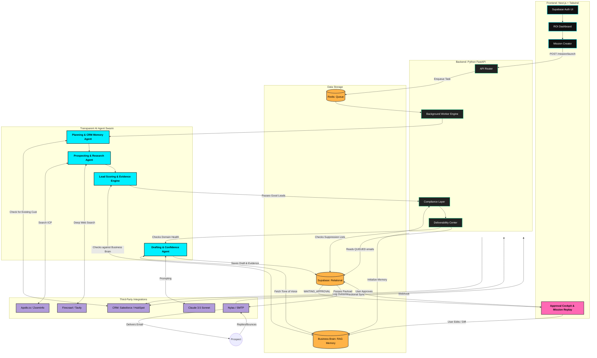

# Visoora System Architecture Diagram

You can copy this block and paste it directly into a Notion "Mermaid" block to render a beautiful, scalable visual architecture diagram!

```mermaid
graph TD
    %% Define Styles
    classDef frontend fill:#111,stroke:#00F0FF,stroke-width:2px,color:#fff;
    classDef backend fill:#222,stroke:#10B981,stroke-width:2px,color:#fff;
    classDef agent fill:#00F0FF,stroke:#000,stroke-width:2px,color:#000,font-weight:bold;
    classDef database fill:#ffb347,stroke:#333,stroke-width:2px,color:#000;
    classDef external fill:#b19cd9,stroke:#333,stroke-width:2px,color:#000;
    classDef trust fill:#ff69b4,stroke:#333,stroke-width:2px,color:#000,font-weight:bold;

    %% 1. FRONTEND
    subgraph Frontend [Frontend: Next.js + Tailwind]
        Login[Supabase Auth UI]:::frontend
        Dashboard[ROI Dashboard]:::frontend
        Creator[Mission Creator]:::frontend
        Cockpit[Approval Cockpit & Mission Replay]:::trust
    end

    %% 2. BACKEND
    subgraph Backend [Backend: Python FastAPI]
        API_Gateway[API Router]:::backend
        JobEngine[Background Worker Engine]:::backend
        Deliverability[Deliverability Center]:::backend
        Compliance[Compliance Layer]:::backend
    end

    %% 3. DATABASES
    subgraph Databases [Data Storage]
        DB[(Supabase: Relational)]:::database
        Redis[(Redis: Queue)]:::database
        VectorDB[(Business Brain: RAG Memory)]:::database
    end

    %% 4. AI AGENT SWARM
    subgraph Agents [Transparent AI Agent Swarm]
        Planner[Planning & CRM Memory Agent]:::agent
        Prospector[Prospecting & Research Agent]:::agent
        Scorer[Lead Scoring & Evidence Engine]:::agent
        Writer[Drafting & Confidence Agent]:::agent
    end

    %% 5. EXTERNAL APIs
    subgraph External [Third-Party Integrations]
        CRM[CRM: Salesforce / HubSpot]:::external
        Scraper[Firecrawl / Tavily]:::external
        LLM[Claude 3.5 Sonnet]:::external
        Data[Apollo.io / ZoomInfo]:::external
        EmailProvider[Nylas / SMTP]:::external
    end

    %% -- FLOW LOGIC --

    %% CRM Sync & Business Brain
    Login --> Dashboard
    CRM <-->|Bi-directional Sync| Backend
    Backend -->|Initialize Memory| VectorDB

    %% Mission Launch Flow
    Dashboard --> Creator
    Creator -->|POST /mission/launch| API_Gateway
    API_Gateway -->|Enqueue Task| Redis
    Redis --> JobEngine

    %% Agent Swarm Flow (Triggered by Worker)
    JobEngine --> Planner
    Planner <-->|Check for Existing Cust| CRM
    Planner --> Prospector
    Prospector <-->|Search ICP| Data
    Prospector <-->|Deep Web Search| Scraper
    Prospector --> Scorer
    Scorer <-->|Checks against Business Brain| VectorDB
    Scorer -->|Passes Good Leads| Compliance
    
    %% Trust Layer Pre-Check
    Compliance <-->|Checks Suppression Lists| DB
    Compliance --> Deliverability
    Deliverability -->|Checks Domain Health| Writer

    %% Drafting
    Writer <-->|Fetch Tone of Voice| VectorDB
    Writer <-->|Prompting| LLM
    Writer -->|Saves Draft & Evidence| DB

    %% Human Governance
    DB -->|WAITING_APPROVAL| Cockpit
    Cockpit -->|User Edits / Diff| VectorDB
    Cockpit -->|User Approves| DB

    %% Dispatch & Loop
    Deliverability -->|Reads QUEUED emails| DB
    DB -->|Passes Payload| EmailProvider
    EmailProvider -->|Delivers Email| Prospect((Prospect))
    Prospect -->|Replies/Bounces| EmailProvider
    EmailProvider -->|Webhook| Backend
    Backend -->|Log Outcome| CRM
```
