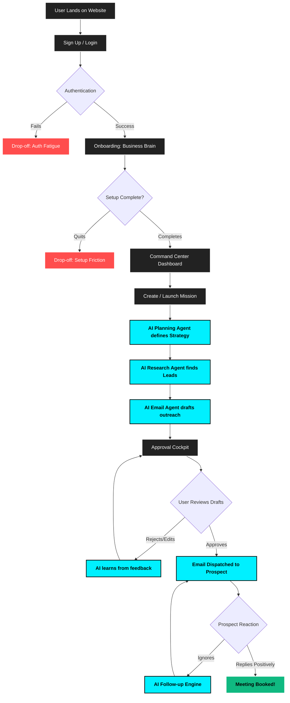

# Visoora: Autonomous AI Sales Command Center
**Investor Product Brief & End-to-End Architecture**

---

## 1. Executive Summary
**What exactly does the product do?**
Visoora is an autonomous AI Sales Development Representative (SDR) platform. Instead of a human manually researching prospects, reading company news, and writing cold emails, Visoora uses a swarm of specialized AI agents to autonomously find leads, conduct deep-dive research, and draft hyper-personalized outreach campaigns. Humans simply review the drafts in an "Approval Cockpit" before they are sent.

## 2. The Problem We Solve
**The B2B Sales Bottleneck:**
- **Time Inefficiency:** Human SDRs spend 80% of their time on administrative tasks (scouring LinkedIn, reading 10Ks, writing emails) and only 20% actually selling.
- **Low Conversion Rates:** Generic, automated drip campaigns (spray-and-pray) no longer work. Buyers demand deep personalization, which is impossible to scale manually.
- **High Turnover & Burnout:** SDRs burn out quickly from repetitive data entry and constant rejection.
- **Lost Revenue:** Leads go cold because human teams cannot research and follow up fast enough.

## 3. The Solution
Visoora acts as a force multiplier for sales teams by introducing **Agentic AI Outreach**. 
- **Business Brain:** Users teach the AI their company's value prop, objections, and tone of voice.
- **Agent Swarm:** Multiple specialized AI agents work together (Planning Agent, Prospecting Agent, Research Agent, Email Agent).
- **Approval Cockpit:** Visoora doesn't replace the human; it elevates them from a *writer* to an *editor*. Humans approve or reject AI-generated drafts with one click.

---

## 4. End-to-End User Flow Architecture

---

## 5. Step-by-Step User Flow & Drop-off Mitigation

This section breaks down exactly what the user experiences at each stage, what the system does in the background, and how we prevent users from abandoning the product.

### Step 1: Acquisition & Onboarding
* **User Action:** The user lands on the website, signs up via email/password, and enters the "Business Brain" onboarding.
* **What it does:** The user inputs their company URL, value proposition, and target audience. 
* **Drop-off Possibility:** Users may abandon the setup if the form is too long or requires too much manual typing.
* **Mitigation:** We use an AI crawler. The user only enters their website URL, and Visoora automatically scrapes their site to fill in the "Business Brain" details for them, reducing onboarding friction to near zero.

### Step 2: The Command Center (Dashboard)
* **User Action:** The user arrives at the central dashboard showing their pipeline value, active missions, and recent wins.
* **What it does:** Serves as the central hub. Instead of a blank slate, the AI immediately recommends a "First Mission" based on their onboarding data to get them to the "Aha!" moment instantly.
* **Drop-off Possibility:** "Blank Canvas Paralysis" — users don't know what to do next.
* **Mitigation:** The AI proactively suggests a pre-configured mission (e.g., "Find Healthcare Prospects"). The user just has to click "Launch".

### Step 3: Mission Launch (The Agent Swarm)
* **User Action:** The user clicks "Deploy Mission" and watches the AI go to work.
* **What it does:** In the background, the **Planning Agent** defines the search criteria. The **Research Agent** scours the web (LinkedIn, news, SEC filings) to find hyper-relevant leads. The **Email Agent** drafts personalized emails referencing the research.
* **Drop-off Possibility:** The user gets bored waiting for the AI to process data.
* **Mitigation:** A beautiful, real-time "Mission Replay" UI shows the user exactly what the AI is thinking and doing live (e.g., "Analyzed 12 websites", "Rejected 4 bad fits", "Drafting email...").

### Step 4: The Approval Cockpit (The Trust Layer)
* **User Action:** The user receives a notification that drafts are ready. They enter the Approval Cockpit to review the AI's work.
* **What it does:** Displays the drafted email side-by-side with an "Evidence Log" showing *why* the AI wrote what it wrote (e.g., "I mentioned their recent Series B funding found on TechCrunch").
* **Drop-off Possibility:** The AI writes bad emails, causing the user to lose trust and churn.
* **Mitigation:** The Evidence Log builds trust by making the AI *explainable*. If the user edits the email, the system saves the feedback, ensuring the AI never makes the same mistake twice.

### Step 5: Dispatch & Conversion
* **User Action:** The user clicks "Approve". The system sends the email.
* **What it does:** The email is sent through the user's connected mailbox. If the prospect replies, Visoora reads the reply and alerts the user. If the prospect ignores it, the **Follow-up Engine** automatically generates a context-aware follow-up days later.
* **The Final Outcome:** The prospect books a meeting on the user's calendar.

---

## 6. Why Investors Should Care (The Moat)

1. **Not a Wrapper:** Visoora isn't a simple ChatGPT wrapper. It is a multi-agent orchestrated system (DAG-based workflows) with memory and learning loops.
2. **The "Human-in-the-Loop" Advantage:** Enterprise companies are afraid of AI sending rogue emails. Visoora's Approval Cockpit acts as a required trust layer, making it enterprise-ready on day one.
3. **Data Flywheel:** Every time a user edits an email in the Approval Cockpit, Visoora captures that edit as training data. The longer a company uses Visoora, the more perfectly it mimics their top salesperson, creating massive switching costs and low churn.
